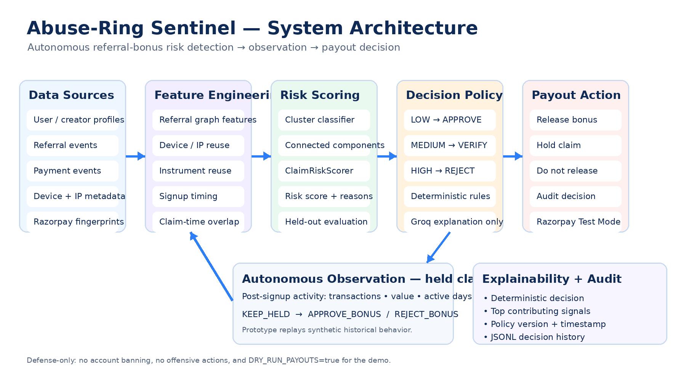

# 🛡️ Abuse-Ring Sentinel

### Autonomous referral-bonus fraud detection that separates coordinated abuse rings from genuine friends and family — before a payout is released.

Built for the **Razorpay AI Buildathon 2026 — Track 2: AI Risk Manager**.

> **Detect the ring. Protect the genuine user. Automate the payout decision.**

---

# Abuse-Ring Sentinel

[Your existing project description]

## 🚀 Live Demo

👉 [Open Live Dashboard](YOUR_STREAMLIT_URL)

🔗 [Backend API](YOUR_RENDER_URL/docs)

---

[rest of your existing README]

## 🚨 The problem

Referral programs can leak money when one operator creates or controls many identities, connects them through referrals, reuses devices/IPs/payment instruments, claims bonuses, and disappears.

The harder problem is avoiding false positives.

A genuine family or group of friends can also:
- sign up around the same event
- share Wi-Fi or an IP
- occasionally share a payment instrument
- create a burst of referrals

**Abuse-Ring Sentinel combines multiple signals instead of blocking users on a single heuristic.**

---

## 🧠 What the system does

```text
Referral / Signup / Payment Events
                │
                ▼
       Referral Graph Analysis
                │
                ▼
        Feature Engineering
     ┌──────────┼───────────┐
     │          │           │
   Graph     Identity    Behavior
  Signals     Reuse       Signals
     └──────────┼───────────┘
                ▼
        Fraud-Ring Scoring
                │
        ┌───────┼────────┐
        ▼       ▼        ▼
       LOW    MEDIUM    HIGH
        │       │        │
        ▼       ▼        ▼
     APPROVE   HOLD    REJECT
                │
                ▼
      Autonomous Observation
          for held claims
                │
          ┌─────┴─────┐
          ▼           ▼
       RELEASE      REJECT
                │
                ▼
        Razorpay Payout Gate
```

---

## 🏗️ Architecture



The architecture separates **risk detection, decisioning, explanation, and payout control**.

### Core components

| Component | Responsibility |
|---|---|
| **Referral Graph** | Finds connected referral networks and candidate abuse clusters |
| **Feature Engineering** | Builds graph, identity, timing and behavioral signals |
| **ML Risk Scoring** | Scores the likelihood of coordinated abuse |
| **Claim Risk Engine** | Makes an immediate claim-time decision |
| **Autonomous Observation** | Re-evaluates held claims using post-signup behavior |
| **Decision Policy** | Converts risk into approve / hold / reject |
| **Groq** | Generates human-readable explanations |
| **Razorpay Integration** | Payment fingerprints, webhooks and payout gating |
| **Audit Log** | Records decisions, reasons, policy version and outcomes |

---

## 🤖 Autonomous decision workflow

### Stage 1 — Claim-time decision

When a user requests a referral bonus, Sentinel evaluates only information available **at claim time**.

| Risk score | Decision | Action |
|---:|---|---|
| **< 0.30** | **APPROVE_BONUS** | Release |
| **0.30 – < 0.70** | **VERIFY_CLAIM** | Hold |
| **≥ 0.70** | **REJECT_BONUS** | Do not release |

The decision is deterministic and auditable.

### Stage 2 — Autonomous observation

A held claim can enter a second stage that checks post-signup activity:

- transaction count
- transaction value
- active days
- genuine engagement

The system can then resolve:

```text
HELD → APPROVE_BONUS
```

or

```text
HELD → REJECT_BONUS
```

without requiring an operator to manually repeat the same checks.

**Prototype note:** the observation stage currently replays historical behavior from the synthetic dataset. A production implementation would consume a merchant transaction/event stream or webhook events.

---

## 🔍 Signals that matter

### Network signals
- referral connections
- connected-user count
- graph density
- referral depth
- fan-out patterns
- signup burstiness

### Identity signals
- device reuse
- IP reuse
- payment-instrument reuse
- multi-signal overlap

### Behavioral signals
- transactions after signup
- transaction value
- active days
- zero-engagement rate

The strongest evidence comes from **multiple signals agreeing**, rather than one signal being treated as proof of fraud.

---

## 💳 Razorpay integration

The project includes a **Razorpay Test Mode** integration.

### Payment fingerprints

Supported payment information can be converted into identity-linking signals, including card and UPI-related identifiers where available.

### Webhooks

```text
POST /webhook/razorpay/payment
```

The webhook records payment events and fingerprints for downstream risk analysis.

### Payout gate

Approved decisions pass through the payout gate.

For the buildathon demo:

```text
DRY_RUN_PAYOUTS=true
```

**No real money moves.**

---

## 🧩 AI / ML design

### Machine learning

The cluster-level detector is trained on graph, identity and behavioral features and evaluated on a **held-out test set**.

### Graph analysis

NetworkX identifies connected referral components and provides structural features for risk scoring.

### Groq

Groq is used for **explanation only**.

It receives the computed decision and supporting facts and produces a human-readable explanation.

> **The LLM cannot override the risk policy or authorize a payout.**

---

## 📊 Evaluation

The benchmark is **synthetic** and contains fraud-ring, family/friend and organic clusters.

### Held-out test results

| Metric | Result |
|---|---:|
| Precision | **100%** |
| Recall | **95%** |
| F1 | **97.4%** |
| ROC-AUC | **1.00** |
| False positives | **0** |
| False negatives | **2** |
| Net value created | **≈ ₹106,832** |

These are **synthetic benchmark results, not production performance claims**.

The generator includes difficult cases such as stealthier fraud rings and legitimate bursty family/friend behavior.

### False-positive cost

False positives are treated as a real business cost because wrongly holding a genuine reward can create:

- manual-review work
- support overhead
- user friction
- goodwill/reputation risk

The evaluation therefore tracks false-positive cost instead of treating all errors as equivalent.

---

## 🎬 Demo scenarios

### 🟢 Genuine user

```text
LOW RISK
   ↓
APPROVE_BONUS
   ↓
RELEASED_SIMULATED
```

### 🟠 Ambiguous friend/family case

```text
MEDIUM RISK
   ↓
VERIFY_CLAIM
   ↓
HELD
   ↓
AUTONOMOUS OBSERVATION
   ↓
APPROVED / REJECTED
```

### 🔴 Coordinated abuse

```text
HIGH RISK
   ↓
REJECT_BONUS
   ↓
NOT_RELEASED
```

---

## 🖥️ Dashboard

The Streamlit dashboard provides:

- fraud-ring and cluster overview
- network visualization
- risk scores and contributing signals
- claim-level decisions
- autonomous observation for held claims
- payout-gate status
- Groq explanations
- decision history / audit information

Run it with:

```bash
streamlit run dashboard.py
```

---

## ⚡ Quick start

### 1. Clone

```bash
git clone https://github.com/sanvi-kanala/abuse-ring-sentinel.git
cd abuse-ring-sentinel
```

### 2. Create an environment

**Windows PowerShell**

```powershell
python -m venv .venv
.venv\Scripts\Activate.ps1
```

**macOS / Linux**

```bash
python3 -m venv .venv
source .venv/bin/activate
```

### 3. Install dependencies

```bash
pip install -r requirements.txt
```

### 4. Configure environment variables

```text
Copy .env.example → .env
```

Add test-mode credentials if you want to exercise the Razorpay integration.

**Never commit **.env**.**

### 5. Run the pipeline

```bash
python run_pipeline.py
```

This generates the synthetic dataset, builds features, trains/evaluates the model and produces the generated reports.

### 6. Start the API

```bash
uvicorn src.api.main:app --reload --port 8000
```

API docs:

```text
http://localhost:8000/docs
```

### 7. Start the dashboard

```bash
streamlit run dashboard.py
```

### 8. Run tests

```bash
python -m pytest tests/ -v
```

---

## 🔌 API

| Method | Endpoint | Purpose |
|---|---|---|
| **GET** | **/health** | Service health |
| **POST** | **/claim-bonus** | Evaluate a bonus claim |
| **GET** | **/claim-decisions** | View claim decisions |
| **POST** | **/claim-observation/{claim_id}/resolve** | Resolve a held claim through observation |
| **POST** | **/score-cluster** | Score a referral cluster |
| **GET** | **/clusters/{cluster_id}** | Inspect a cluster |
| **POST** | **/webhook/razorpay/payment** | Receive payment events |
| **GET** | **/report/summary** | Read evaluation summary |

---

## 📁 Project structure

```text
abuse-ring-sentinel/
├── dashboard.py
├── run_pipeline.py
├── requirements.txt
├── .env.example
├── docs/
│   └── architecture.png
├── reference/
│   └── disposable_domains.txt
├── src/
│   ├── api/
│   │   └── main.py
│   ├── external_apis/
│   │   ├── disposable_email.py
│   │   └── ip_geolocation.py
│   ├── features/
│   │   ├── build_features.py
│   │   └── claim_features.py
│   ├── model/
│   │   └── train_eval.py
│   ├── pipeline/
│   │   ├── claim_observation.py
│   │   ├── claim_risk.py
│   │   ├── generate_dashboard.py
│   │   └── score_cluster.py
│   └── razorpay_integration/
│       ├── client.py
│       ├── payout_gate.py
│       └── run_autonomous_demo.py
└── tests/
```

Generated datasets and reports are intentionally excluded from Git.

---

## 🛡️ Defense-only

Abuse-Ring Sentinel is designed strictly for fraud prevention.

It does **not**:
- generate fraud techniques
- help bypass fraud detection
- attack external systems
- retaliate against users
- automatically ban accounts
- move real money in the demo

The goal is simple:

> **Reduce fraudulent bonus payouts while minimizing unnecessary friction for legitimate users.**

---

## 🔭 Production path

The buildathon prototype can evolve toward:

- real-time signup/referral/payment event ingestion
- streaming referral graphs
- stronger entity resolution
- merchant-specific policies
- threshold calibration from labeled incidents
- human-review feedback loops
- model drift monitoring
- persistent audit storage
- cloud deployment

---

## ⚠️ Limitations

This is a buildathon prototype.

- The evaluation dataset is synthetic.
- Real production traffic will be noisier.
- Thresholds require calibration against real labeled incidents.
- Payment-instrument reuse is not universally available.
- Autonomous observation currently replays synthetic historical activity.

---

## 📜 License

MIT

